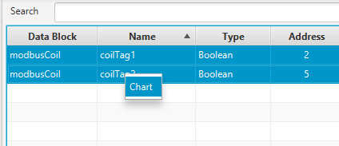
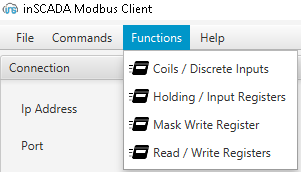
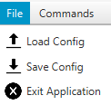

# Modbus TCP/UDP Client - inSCADA

inSCADA Modbus TCP/UDP Client is a desktop application used to connect, monitor, and interact with Modbus TCP/UDP devices. It supports reading and writing coils and registers, managing data blocks, and visualizing real-time data.


---

## 📑 Table of Contents
* [1. Setup](#1-setup)
  * [1.1 Setup for Windows](#11-setup-for-windows)
  * [1.2 Setup for Ubuntu](#12-setup-for-ubuntu)
* [2. Application](#2-application)
  * [2.1 Connection Settings](#21-connection-settings)
  * [2.2 Data Block & Tag Settings](#22-data-block--tag-settings)
  * [2.3 Using Functions](#23-using-functions)
  * [2.4 Logs](#24-logs)
  * [2.5 Save / Load](#25-save--load)
* [3. License](#3-license)

---

## 1. Setup

### 1.1 Setup for Windows
This application is designed as click-to-run on Windows. No installation is required.
After downloading, simply run:
ins-mod-cli.exe

### 1.2 Setup for Ubuntu
You need at least version 11 of OpenJDK and OpenJFX to run the application.

#### 1.2.1 Install Dependencies
```bash
sudo apt-get update
sudo apt-get upgrade
sudo apt install openjdk-11-jre
sudo apt install openjfx
```

#### 1.2.2 Run Application
```bash cd jars/downloaded/location
java --module-path /usr/share/openjfx/lib --add-modules javafx.controls,javafx.fxml -jar ins-mod-cli.jar
```

---

## 2. Application

### 2.1 Connection Settings
After starting the application, configure the settings according to your slave device.  If your settings are true you should be able to establish a successful connection.


* **Connection Type:** Select TCP or UDP.
* **IP Address:** Enter the server (slave) device IP.
* **Port:** Enter the device port (Default: 502).
* **Unit Address:** Enter the Modbus Slave ID (Unit ID).
* **Timeout:** Enter the timeout in ms.
* **Scan Time:** Enter the scan time in ms.
* **Start / Stop:** Once started, the application checks connection status every 2 seconds.

### 2.2 Data Block & Tag Settings
Define Data Blocks first, then add individual Tags within them.


#### 2.2.1 Data Blocks


* **Name:** Must be unique; used as a unique identifier.
* **Start Address Ranges:**
  - Coil: 1 – 9999
  - Discrete Input: 10000 – 19999
  - Holding Register: 40000 – 49999
  - Input Register: 30000 – 39999

#### 2.2.2 Tags
Every Data Block has its own Tags. You must define a Data Block before you add any tag.


* **Name:** Like Data Block names, Tag names must be defined and unique.
* **Type:** Select the data type you wish to read or write (e.g., Integer, Float, Boolean).
* **Address:** Must be within the range of the parent Data Block. 
    * *Example:* If the Data Block Start Address is `1` and Amount is `10`, the valid Tag Address range is `1 – 11`.
* **Byte / Word Swap:** Toggle these fields based on the required endianness of your device.
* **Setting Values:** You can modify a tag's value by double-clicking the specific tag in the table to open the **Set Value** tab.
* **Chart:** Select one or more tags (use `CTRL` for multi-select), Right-Click, and choose **Chart**.
    * The chart displays values vs. time. 
    * Hover over points to see specific data.
    * Click the legend to filter specific tags.
 


---

### 2.3 Using Functions
Access specialized Modbus functions via the Menu Bar:



* **Coils / Discrete Inputs:** Read or write multiple bits.
* **Holding / Input Registers:** Read and write registers.
* **Mask Write Register:** Bitwise AND/OR operations on Holding Registers.
* **Read / Write Register:** Simultaneous operations in a single request.

---

### 2.4 Logs
Monitor application operations, requests, and errors in the Log section.


* **INFO (Blue):** General information.
* **ERROR (Red):** Communication or system errors.
* **WARNING (Yellow):** Non-critical alerts.
* **Export:** Save logs as a .txt file for external troubleshooting.

### 2.5 Save / Load
Use the File menu to manage your setup:



* **Save Config:** Export settings as a .json file.
* **Load Config:** Import a previously saved .json configuration.
* **Exit:** Closes the application safely.

---

### 3. License
This project is licensed under the Apache License 2.0.
